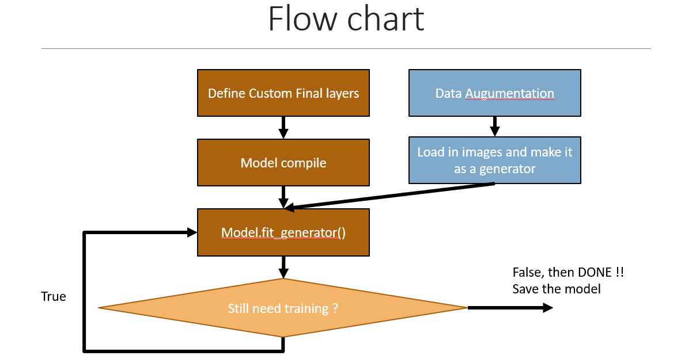
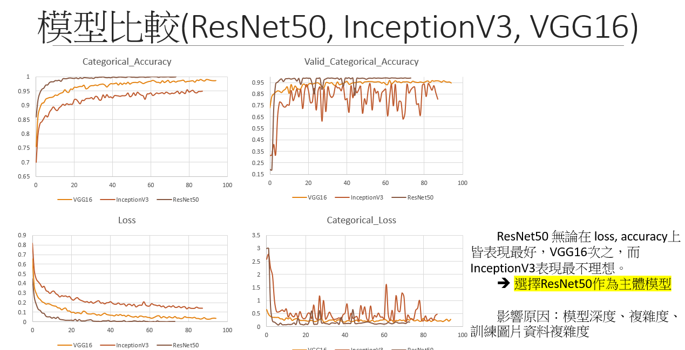
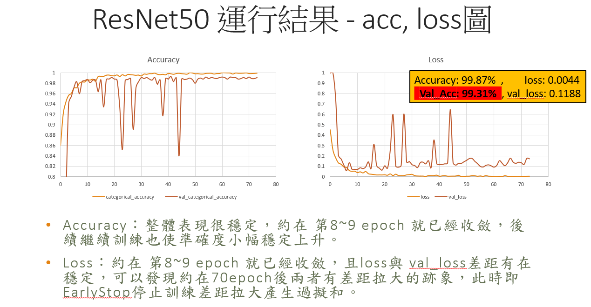
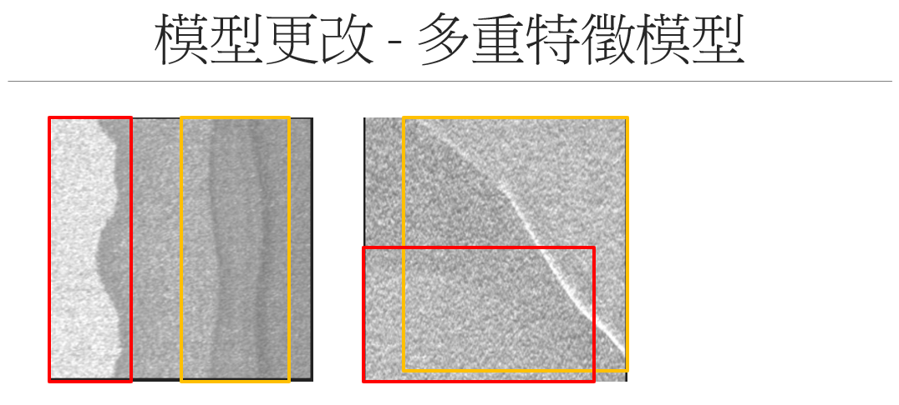

# AOI 晶圓缺陷辨識

# 訓練過程

# 結果與分析

最後選擇以 Resnet50 作為遷移學習的基底，獲得的預測成果駔好

# 模型不足之處

AOI defect 可以有不只一種 defect type。然後我們當前模型僅僅會找出信心水準最高的 defect type。

==> 以 R-CNN, faster R-CNN, YOLO 等多重特徵模型改寫

# 後續改善方向

## 剔除不合理的圖片、垃圾資料：

我們有利用 imagehash 來嘗試剔除可能是潛在垃圾的圖片，例如說過度模糊、標示錯誤的圖片，不過效果不彰。

效果不彰可能原因：

1. 選用作為比較的圖片，不夠具代表
2. imagehash 可能只適用幾乎完全相似的圖片，像缺陷出現在不同地方或大小不同都會使相似度大幅下降，導致篩選錯誤

## 強化學習：

建立一個獎勵機制，在預測 test_images 時也能同時再把輸入轉為輸出，邊預測邊學習。

例如將 softmax 分析出來的機率，若最高機率超過 90%，視為預測正確，獎勵模型再強化。

## 利用 SSO 進行超參數優化

超參數是深度模型的架構，一直是難以用數據來去確切知道改進的方向。我們可以利用 SSO 去不斷演化，直到找出最佳超參數。
